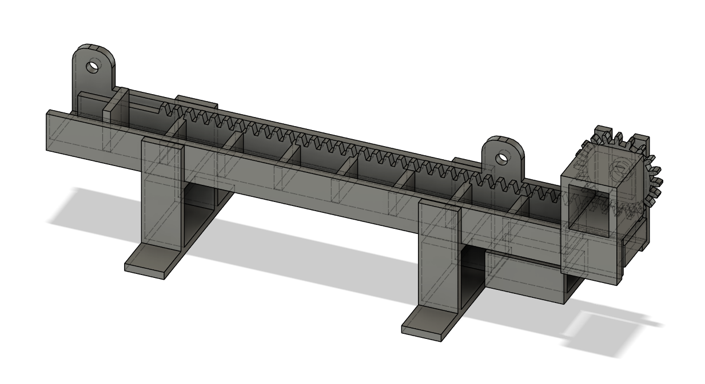
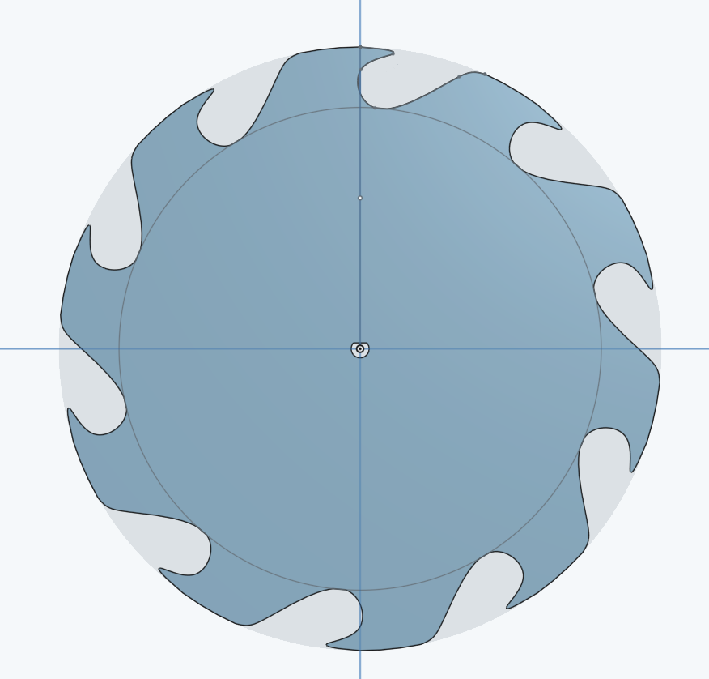
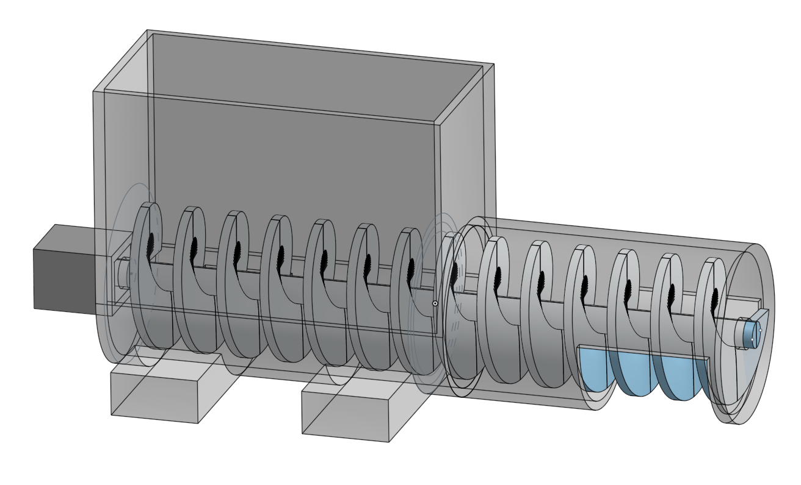
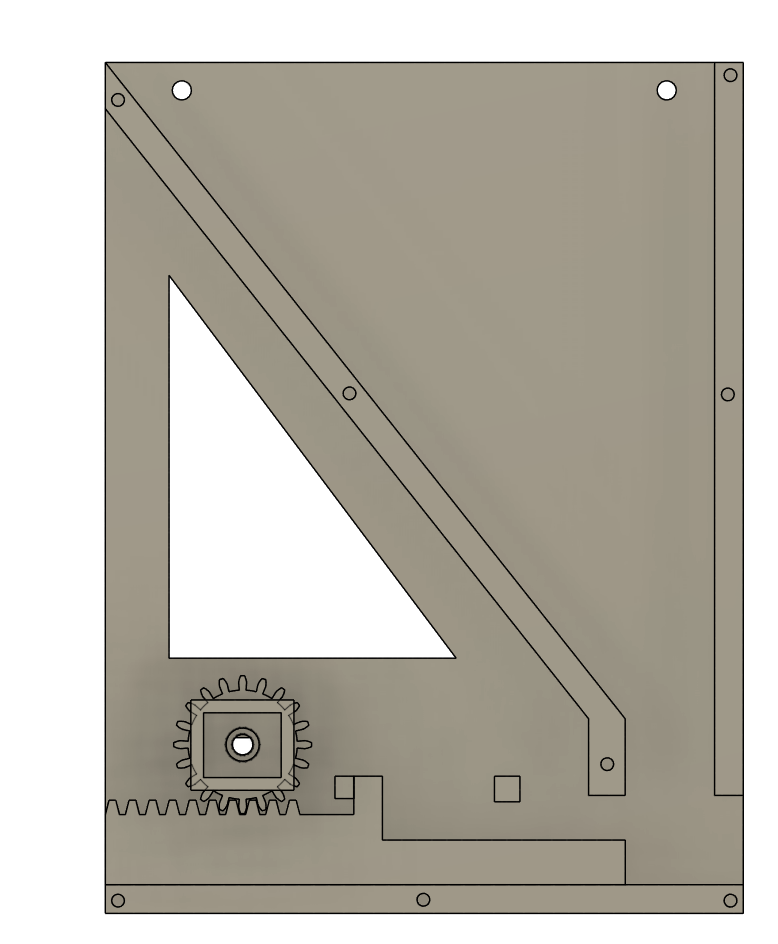

# Kibble Dispenser

## Purpose

This device is meant to automatically dispense cat treats to keep cats active during the day. Treats are placed in the small compartments and randomly dispensed within a given time frame.

## Materials

- Arduino UNO
- Adafruit Motorshield V2 (Probably possible without it though)
- 3d Printed parts
- DC Motor
- Power adapter
- [TCRT5000](https://www.bastelgarage.ch/infrarot-sensor-tcrt5000-naherungsschalter-breakout-modul) IR Sensor
- [OLED Display Blau I2c 128x32 0.91’’](https://www.bastelgarage.ch/oled-display-blau-i2c-128x32-0-91?search=ssd13)
- (optional) Buzzer
- resistors, buttons, wires

## How to build

- 3D print all parts from [/dispenser](/dispenser/)
- laser cut and glue enclosure from [/enclosure](/enclosure/)
- install the necessary libraries (see [Dependencies](#dependencies))
- adjust parameters in the code
- wire everything according to [wiring](#wiring)
- upload code/`code.ino`to Arduino Uno
- adjust TCRT5000 potentiometer, such that it triggers when a kibble falls down, but not when something further away moves

### Wiring

- Button 1 to D11 (with pulldown resistor)
- Button 2 to D12 (with pulldown resistor)
- Display to SDA and SCL
- IR sensor TCRT5000 (digital D0) to D2 (used for interrupt)
- (optional) Buzzer to D9
- DC Motor to M1 port of the Motorshield

## How to use

- Update parameters in the code to fit your preferences.
- Manual kibble dispensing is possible with `button2`
- To reset the dispenser push `button1`

## Different Dispensing Mechanisms

To exactly dispense one kibble each time the machine is triggered was harder than expected. For future reference I'm quickly summarizing all the failed approaches here.

(Pictures below)

From top to bottom:

- Final design and only one to work reliably. Unfortunately, the kibbles need to be placed one by one
- Using a feeding wheel like this was very unreliable. It would often not pickup anything
- The auger screw worked sometimes, but often the kibbles would make clogs in the screw that would dispense all together. Redimensioning to make it smaller lead to a lot of jamming problems.
- Inspired by [mint-dispenser](https://www.google.com/url?sa=i&url=https%3A%2F%2Fwww.redbows.co.uk%2Fmintoxmintdispensers&psig=AOvVaw3w5Bb2xVt6PeC3P82Nj_Pa&ust=1713714905318000&source=images&cd=vfe&opi=89978449&ved=0CBIQjRxqFwoTCICTuN2T0YUDFQAAAAAdAAAAABAE), in this design a plunger pushes the kibble out and when it moves back a new kibble should fall down. However the kibbles managed to form stable bridges in the dispenser.

## Dependencies

- [Adafruit Motor Shield v2](https://www.arduino.cc/reference/en/libraries/adafruit-motor-shield-v2-library/)
- [Adafruit_SSD1306]()
- [Adafruit GFX](https://www.arduino.cc/reference/en/libraries/adafruit-gfx-library/)
- [EasyButton.h](https://www.arduino.cc/reference/en/libraries/easybutton/) by Evert Arias
